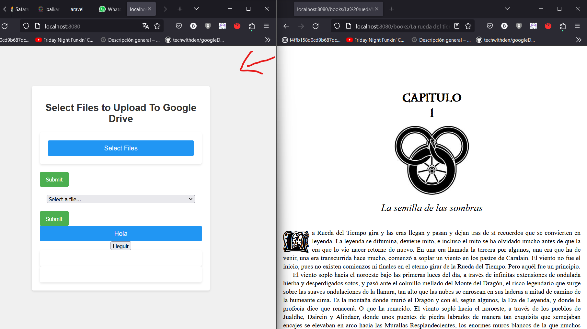

npm install multer
npm install googleapis
npm install adm-zip

# PROGRESO
Mario, 21/03/2024 --> Hasta ahora, podemos subir archivos, descomprimirlos y coger el contenido de la carpeta de contenido y crear los links para ver los capítulos.
Se envian bien los links, y se crea la ventana nueva (no como emergente, eso hay que arreglarlo), pero no se ve el contenido, falta de solucionar este problema.

# 22/03/2024
## Solucion a mostrar el contenido
Benito, 22/03/2024 --> He podido solucionar el mostrar el contenido canviando el puerto que llamabas en la linia 85
por el 8080 (antes estaba en el 3000 y parece que ahora se muestra la portada del libro)
## Pasar las paginas del libro
Lo he podido medio arreglar, hasta ahora se puede abrir el libro en otra pestaña y si clicas en la flecha derecha MIENTRAS estas en la pagina de seleccion de ficheros pasaras de pàgina

y estando ahi le das clic a la flecha de la derecha

# 22/03/2024
## Solucion a mostrar el contenido en una ventana emergente y usar las flechas
Mario, 22/03/2024 --> Ahora el contenido se abre dentro de una ventana emergente, y para solucionar el reacomodado de las flechas al pasar página, simplemente he hecho que el contenido se muestre dentro de un iFrame, así la página no se recarga y no pierde los listeners.

# 28/03/2024
## Intento de cargar desde el drive
 // Intento de cargar desde el drive
 Busca esta linia y lo debajo seran los canvios que he echo
## Eliminar ficheros
He echo que ahora se muestren en una tabla los libros guardados en el drive con 2 botones:
- Eliminar: Elimina el libro del drive y actualiza la tabla
- Leer: Todavia no esta implementado pero lo podriamos utilizar para leer el libro

# 30/03/2024
## Guardar con el nombre en el DRIVE
Mario --> Modificación para guardar con el nombre en vez de ID en DRIVE completada.
FALTA COMPROVACIÓN

## Listar libros directamente del DRIVE
Mario --> Modificación para listar libros cogiendo los títulos desde el DRIVE completada.
FALTA COMPROVACIÓN